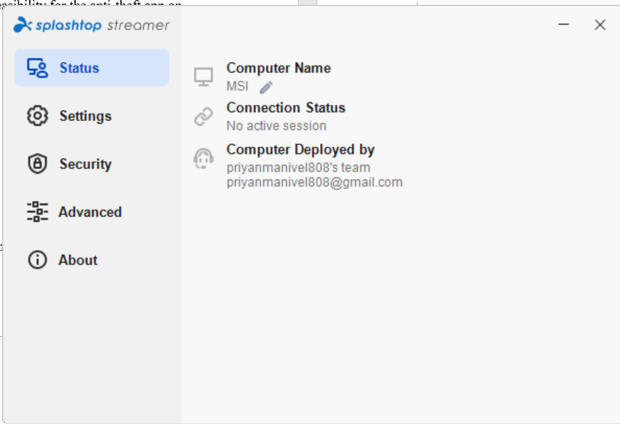
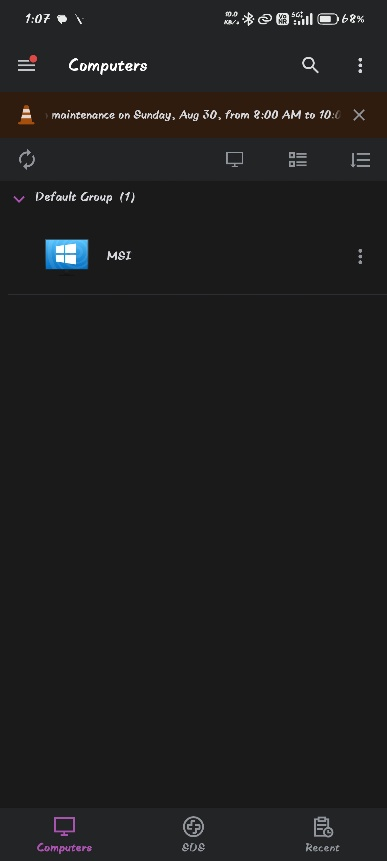
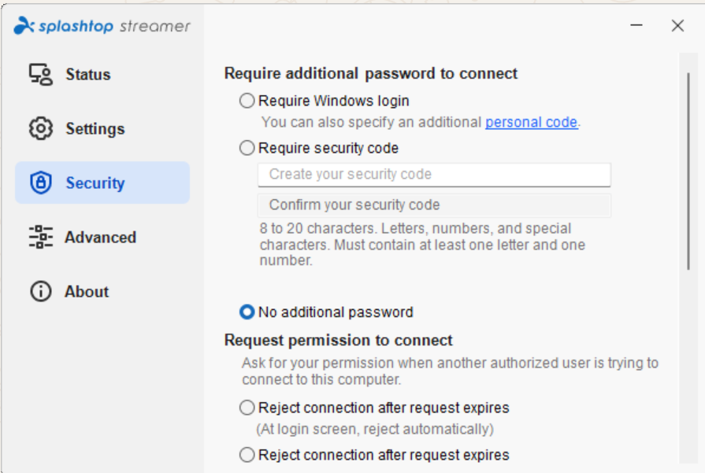
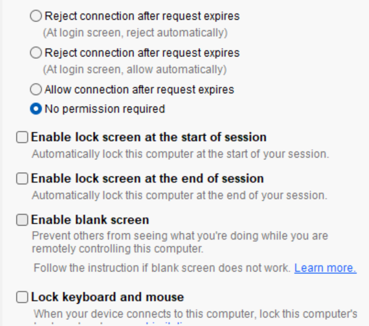
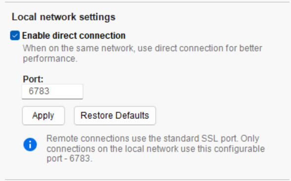

# Splashtop Streamer

## Introduction

This document records the exploration and analysis of Splashtop Streamer, carried out as background research for an Android secure-access / anti-theft application project. Splashtop Streamer was selected as a case study because it is a real-world, publicly available example of a host/agent application that allows a device to be remotely accessed, managed, and secured — the same fundamental pattern (protected device + trusted controller + cloud command layer) that the proposed anti-theft application will need.

The report is organised as a structured walkthrough: application overview, architecture, feature inventory, hands-on Android investigation, security model, feature comparison, a proposed architecture for the anti-theft app, and a set of research/test questions used to guide hands-on testing. Screenshot placeholders are provided throughout so that evidence captured during testing can be inserted directly into this document.

# Chapter 1 — Application Overview

| Field | Details |
|---|---|
| Application | Splashtop Streamer |
| Category | Remote access / remote support / endpoint management |
| Core purpose | Acts as an endpoint-side agent. Once installed and authorized, it makes the target device available for remote access through the Splashtop ecosystem. |

## How Splashtop Works

Splashtop uses two main sides:

- **Business App / client** — installed on the device from which the user initiates remote access.
- **Splashtop Streamer / host agent** — installed on the device that will be remotely accessed.

The normal workflow is: install and authorize the Streamer on the target device, log in through the client application, see the registered device, and initiate a remote session.

For Android specifically, Splashtop supports unattended remote access in enterprise, rugged, and IoT scenarios, and its Android Streamer can be deployed through Android Enterprise / MDM workflows.

## Relevance to Secure Access

Our anti-theft application can adopt a similar high-level architecture: a control server in the cloud, an owner-facing control app, and a background agent running on the protected phone that receives commands from the server.

```text
INTERNET / CLOUD

+----------------------------+
|      Control Server        |
|                            |
| Device registration        |
| Authentication             |
| Command management         |
| Device status              |
| Event logging              |
+-------------+--------------+
              |
       Secure communication
              |
     +--------+--------+
     |                 |
Owner's Control App   Protected Phone
                       |
                  Background Agent
                       |
                  +---- Commands
```

# Chapter 2 — Splashtop Architecture Analysis

Based on Splashtop's publicly documented setup, its architecture can be understood as having four major components.

## 1. Client Application

Used by the authorized user to:

- Log into an account
- View registered devices
- Select a remote device
- Initiate a connection
- Interact with the remote endpoint

## 2. Streamer / Endpoint Agent

Installed on the target system. Its role is to:

- Register the endpoint
- Maintain its availability for remote access
- Receive authorized connection requests
- Provide the remote-access functionality permitted by the device and platform

## 3. Cloud / Management Infrastructure

Splashtop provides centralized management capabilities such as device and account management, access controls, logging, and deployment workflows. Enterprise deployments can also include role-based access, SSO/SAML, and SCIM provisioning.

## 4. Deployment and Device Enrollment

Splashtop supports centrally managed deployment packages, including zero-touch deployment for Android devices using compatible Android Enterprise/MDM infrastructure.

# Chapter 3 — Important Features to Study

Each feature area below should be documented in detail, with an explicit note on how it maps onto the anti-theft project.

| Feature Area | Splashtop Concept | Relevance to Your Project |
|---|---|---|
| Device registration | Endpoint enrolled into account | Register protected phone |
| Authentication | Account + device authentication | Prevent attacker access |
| Remote access | Authorized user connects to endpoint | Owner control panel |
| Unattended access | Access without active user interaction in supported scenarios | Useful when phone is lost |
| Device status | Endpoint availability and status | Online/offline monitoring |
| Encryption | TLS and AES-256 protections | Secure commands and telemetry |
| Access control | Roles and permissions | Owner/admin authorization |
| Logging | Session and activity logs | Theft/security audit trail |
| Remote screen protection | Blank screen / locking features in supported products | Anti-theft response concept |
| Enterprise deployment | Zero-touch deployment | Useful for managed-device version |

Splashtop publicly lists security controls including device authentication, multi-level password security, two-step verification, session timeout, remote connection notifications, configuration locking, and logging. It also states that remote sessions are protected using TLS and 256-bit AES encryption.

# Chapter 4 — Android-Specific Investigation

This is one of the most important parts of the research, since it directly informs feasibility for the anti-theft app on real Android devices.

## A. Installation

Record the following during installation and initial setup:

- Where the Streamer is installed from
- Initial setup flow
- Login/account requirements
- Permissions requested
- Whether special manufacturer add-ons are required
- Whether the application can start automatically after reboot

Splashtop's enterprise Android documentation shows that Streamer deployment may involve granting required permissions and, for some devices, installing manufacturer-specific add-ons such as Samsung Knox integrations.

### Evidence — Installation Screens

*Insert installation screenshots here.*

## B. Device Registration

Document the registration flow:

```text
Device ID
    |
Account association
    |
Authorization
    |
Device appears in management/client interface
    |
Remote access availability
```





### Questions to investigate

- Does each device have a unique identifier?
- Can the device be renamed?
- Can it be removed remotely?
- What happens after reinstalling the application?
- What happens after a factory reset?

### Evidence — Registration Screens


## C. Online/Offline Behaviour

This is particularly relevant to the anti-theft project, since the protected phone must behave predictably under poor or hostile network conditions.

| Situation | What to Observe | Observation |
|---|---|---|
| Wi-Fi ON | Is the device reachable? | yes |
| Mobile data ON | Is the device reachable? | yes |
| Wi-Fi OFF | Does the app reconnect through mobile data? | No |
| Mobile data OFF | What status is shown? | no |
| Airplane mode | Can any communication occur? | no |
| Device reboot | Does the service recover automatically? | Yes |
| Force stop | Can background operation resume? | Yes |
| App uninstall | What protection or notification exists? | Nothing |

### Evidence — Online/Offline Test Screens


# Chapter 5 — Security Model

## Security Mechanisms Observed in Splashtop

Based on Splashtop's published documentation, relevant mechanisms include the following.

### Authentication

- Device authentication
- Password protection
- Two-step verification
- Enterprise SSO/SAML support
- Role-based and granular permissions in certain offerings

### Encryption

Splashtop states that its remote sessions use TLS, including TLS 1.2, together with 256-bit AES encryption.

### Session Protection

- Session idle timeout
- Screen auto-lock
- Remote connection notification
- Copy/paste controls
- File-transfer controls
- Session and activity logging

## Lesson for Our Application

Our anti-theft app should not simply accept a remote command because it comes from the internet. A safer command flow would be:

```text
Owner Authentication
        |
Second-factor verification
        |
Server validates request
        |
Server generates authenticated command
        |
Encrypted delivery to device
        |
Device verifies command integrity
        |
Command executed
        |
Result returned and logged
```

# Chapter 6 — Feature Comparison With Your Proposed App

| Feature | Splashtop | Your Proposed App |
|---|---|---|
| Remote device access | Yes | Yes, but anti-theft focused |
| Device management | Yes | Yes |
| Online communication | Yes | Yes |
| Offline fallback | Not the same as your proposed SMS recovery concept | Proposed feature |
| Device tracking | Not the primary Streamer use case | Core feature |
| Theft mode | Not the primary purpose | Core feature |
| Emergency alarm | Not a primary Streamer feature | Core feature |
| Network recovery | Enterprise/device-management dependent | Proposed research area |
| Owner security dashboard | Yes, through management/client infrastructure | Required |
| Anti-theft automation | Not primary | Potential differentiator |

# Chapter 7 — Your Potential Unique Architecture

Instead of copying Splashtop, the anti-theft application can reuse the remote-agent concept and specialize it for theft recovery.

## 1. Android Security Agent (installed on the protected phone)

- Device registration
- Periodic secure check-in
- Location reporting when permission and system conditions allow
- SIM/network state monitoring where platform APIs permit
- Theft event detection
- Receiving authenticated commands
- Triggering alarms/lock workflows within Android's security model

## 2. Owner Control Application (installed on another trusted device)

```text
My Devices
   |-- Last known location
   |-- Online/offline status
   |-- Battery status
   |-- Network status
   |-- Last check-in
   |-- Trigger alarm
   |-- Lock device
   +-- Security event history
```

## 3. Cloud Command Server

- Authentication
- Device registry
- Secure command delivery
- Push notifications
- Status storage
- Audit logs
- Command history

## 4. Fallback Communication Layer

This requires careful Android-platform research. Rather than assuming an app can always turn the network back on using SMS, we should explicitly investigate what modern Android versions permit for ordinary apps versus privileged/device-owner/OEM applications. That distinction is critical because Android security restrictions may prevent a normal third-party app from silently changing certain system network settings.

# Chapter 8 —Test Sheet

A test sheet should be created for every experiment performed on Splashtop Streamer. Record actual results and attach screenshots for each test.

| Test ID | Feature | Steps | Expected Result | Actual Result |
|---|---|---|---|---|
| ST-01 | Installation | Install Streamer | Successful installation | Successful |
| ST-02 | Registration | Login and register | Device associated | Successful |
| ST-03 | Remote connection | Connect from client | Session starts | Successful |
| ST-04 | Wi-Fi loss | Disable Wi-Fi | Observe reconnection | Successful |
| ST-05 | Reboot | Restart device | Agent recovery | |
| ST-06 | Permission removal | Revoke permission | Observe behavior | |
| ST-07 | Logout | Remove authorization | Access revoked | |
| ST-08 | Security | Try unauthorized login | Access blocked | |
| ST-09 | Network loss | Disable connectivity | Offline state | Just struck in the same frame . |
| ST-10 | Recovery | Restore network | Reconnection | fails |

# Some other explored features in this app

## 1. Require Additional Password to Connect

Splashtop Streamer provides an additional authentication layer before allowing a remote connection. It can require the Windows login credentials or a separate security code containing letters and numbers.

## 2. Request Permission to Connect

This feature allows the device owner to control whether an incoming remote connection requires permission. The connection can be automatically rejected when the permission request expires, or it can be configured to allow the connection without additional approval.

## 3. Enable Lock Screen at the Start of Session

When enabled, the computer's screen is automatically locked when a remote session begins. This prevents unauthorized local users from accessing the computer while it is being remotely controlled.

## 4. Enable Lock Screen at the End of Session

This option automatically locks the computer when the remote session ends. It provides an additional security layer by preventing local access immediately after remote control is completed.

## 5. Enable Blank Screen

The blank-screen feature hides the computer's display from people physically near the device during a remote session. This protects the privacy of information being accessed or displayed remotely.

## 6. Lock Keyboard and Mouse

This feature disables the local keyboard and mouse while the device is being remotely controlled. It prevents physical users from interfering with the remote operator's actions.

## 7. Enable Direct Connection

Splashtop can establish a direct connection when the remote device and the controlling device are on the same local network. This can improve remote-session performance by reducing communication latency.

## 8. Port Configuration

The application allows the port used for local direct connections to be configured, with 6783 shown in the screenshot. This provides control over the network endpoint used for communication within the local network.



## 9. Reject Connection After Request Expires

This setting automatically rejects a remote connection when the user's permission request is not accepted within the allowed time. It provides time-limited authorization and prevents old connection requests from remaining valid indefinitely.

## 10. Allow Connection After Request Expires

This option allows the remote connection to proceed even after the original permission request has expired. It provides a more permissive connection policy compared with automatic rejection.

## 11. No Permission Required

When selected, the system does not require manual approval from the local user before establishing a remote session. This is particularly useful for unattended remote access, where the device may not have anyone available to approve the connection.




