# Splashtop Streamer

> **Exact visual copy of the supplied Word document.**
>
> The pages below are rendered directly from the Word document as images. This preserves the original page layout, headings, tables, diagrams, screenshots, spacing, and formatting when viewed from the Markdown repository.

## Page 1

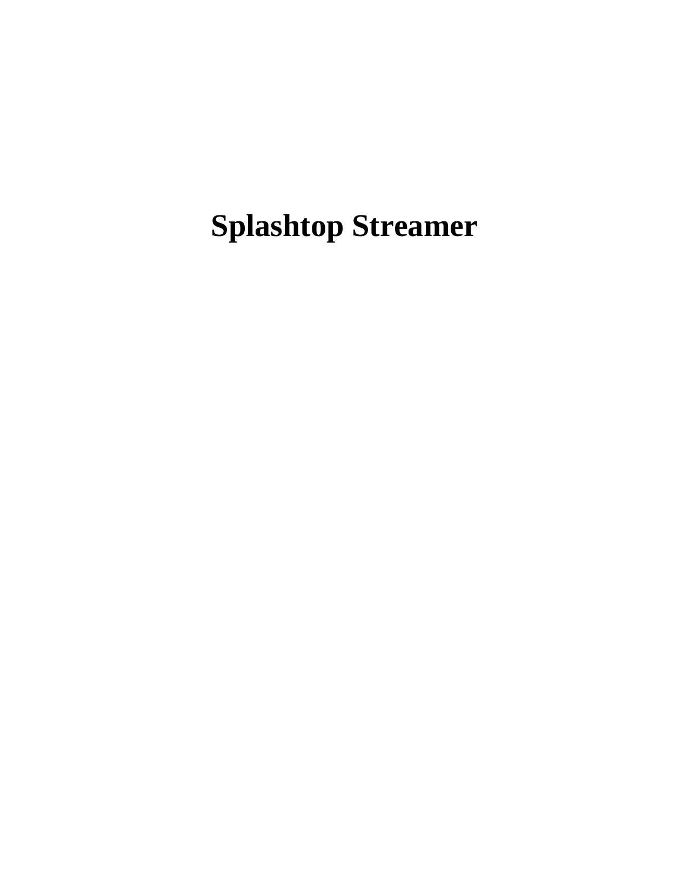

---

## Page 2

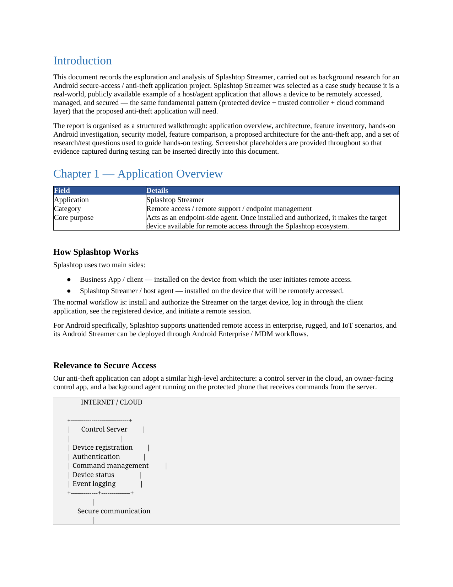

---

## Page 3

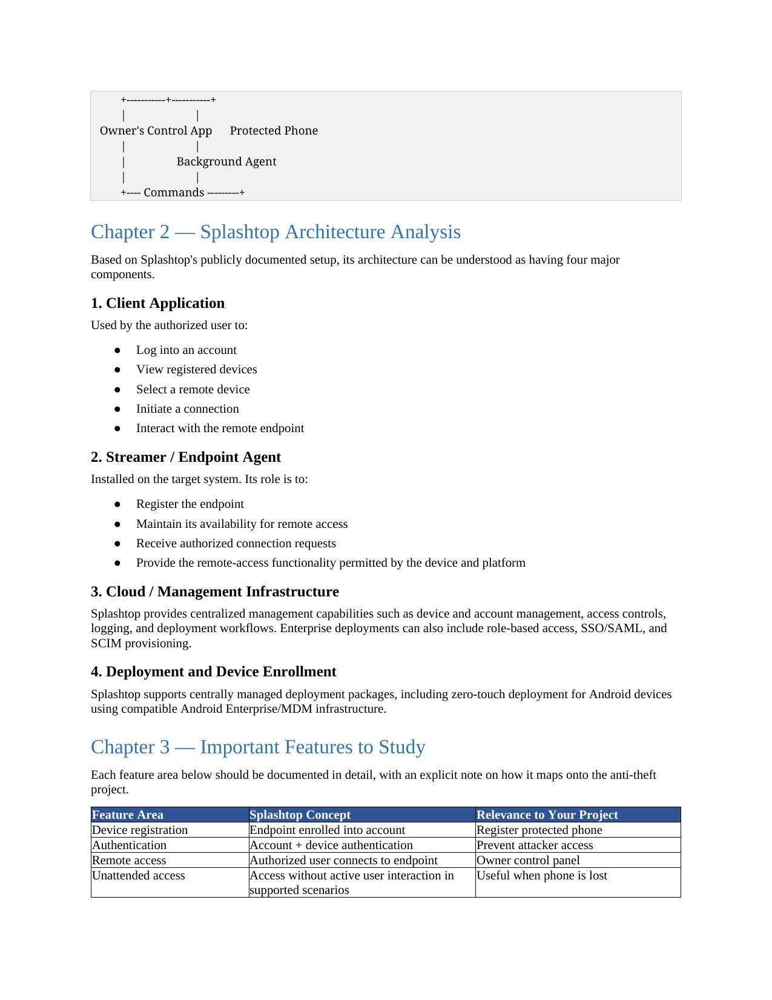

---

## Page 4

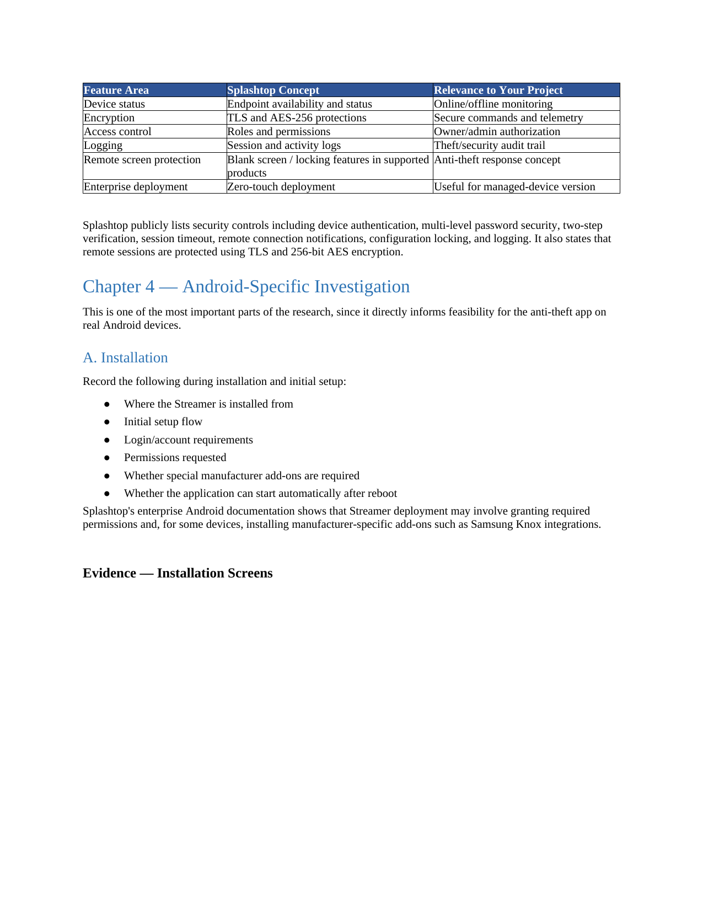

---

## Page 5

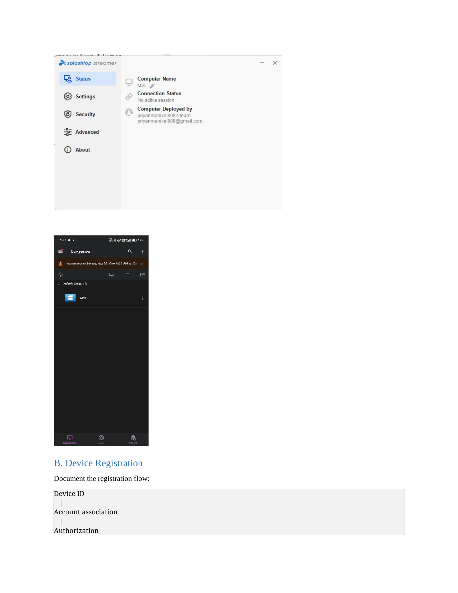

---

## Page 6

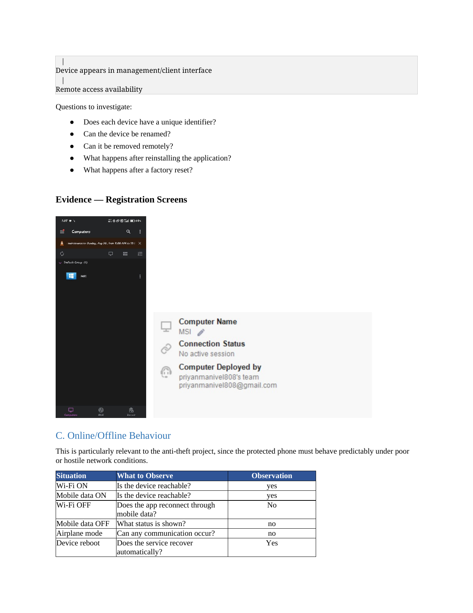

---

## Page 7

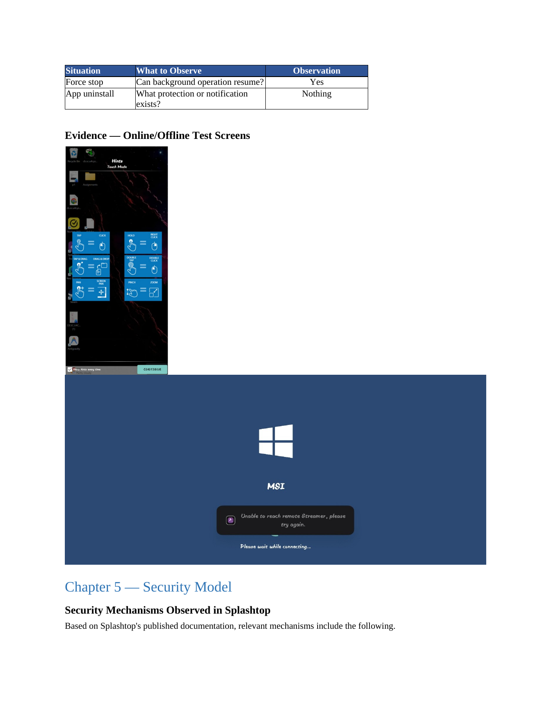

---

## Page 8

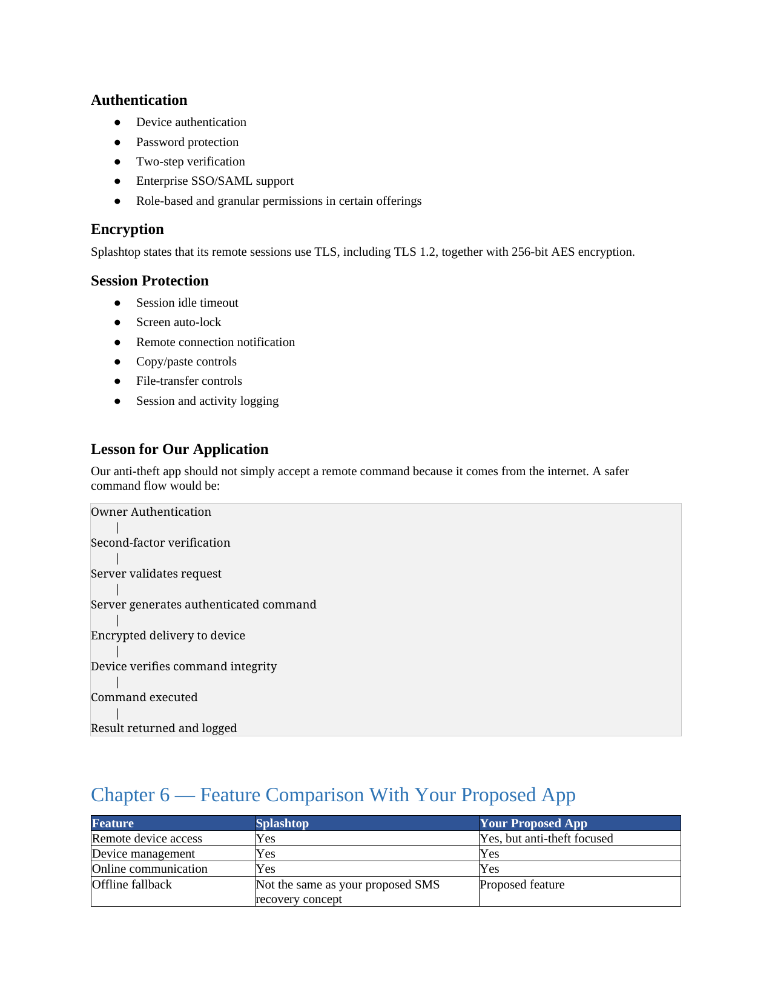

---

## Page 9

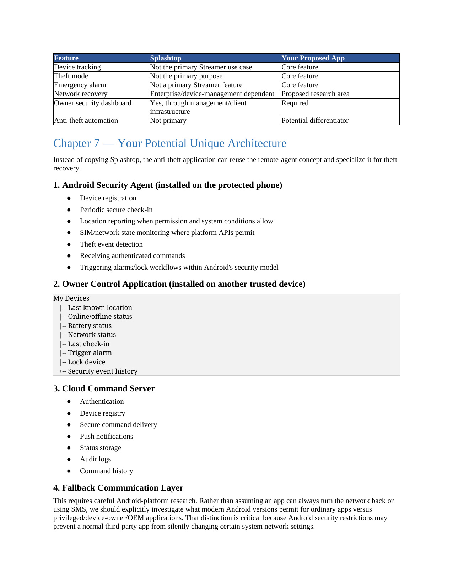

---

## Page 10

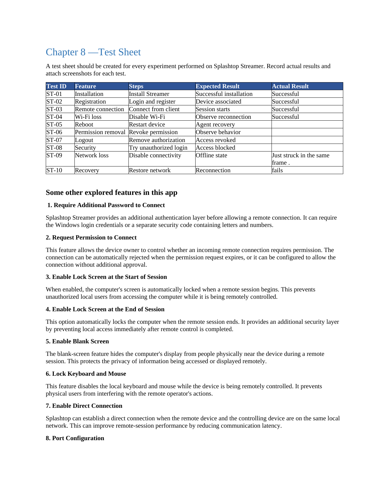

---

## Page 11

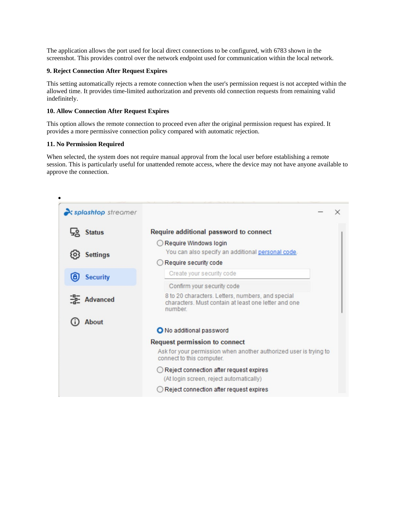

---

## Page 12

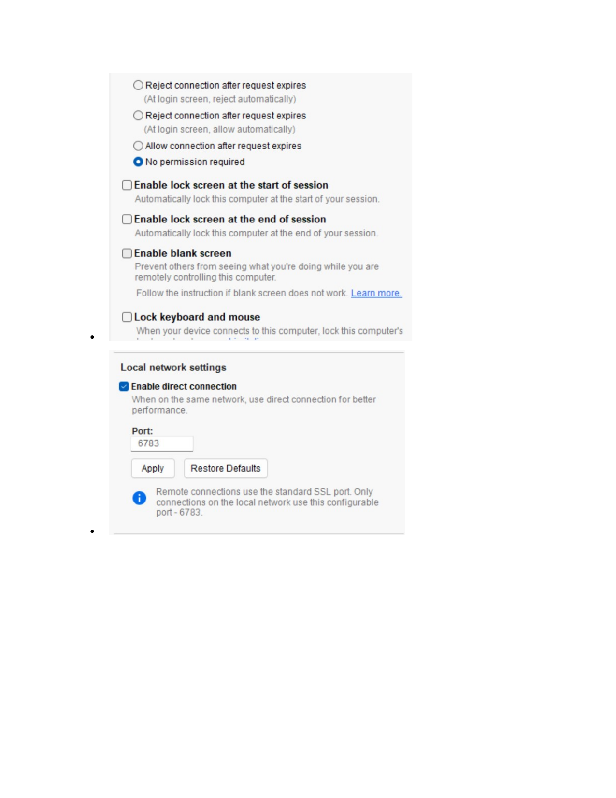

---
